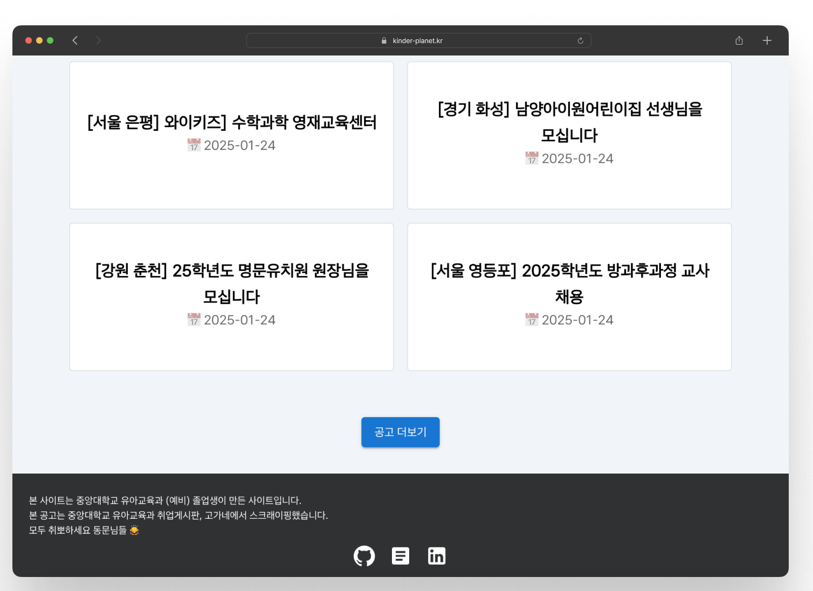
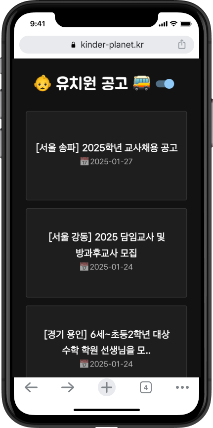

# 🏫 KinderPlanet - 유치원 공고 모아보기

**KinderPlanet**은 중앙대학교 유아교육과 졸업생 및 재학생을 위한 유치원 채용 공고 모아보기 서비스입니다.  
중앙대학교 유아교육과 취업게시판과 **고가네**에서 공고를 스크래핑하여 한눈에 확인할 수 있도록 제공합니다.

🔥 **취뽀하세요 동문님들! 🙇‍♀️**

## 🎨 UI 미리보기

| 💻 Desktop                         | 📱 Mobile                     |
| ---------------------------------- | ----------------------------- |
|  |  |

---

## 📌 주요 기능

✔ **채용 공고 모아보기** - 중앙대 유아교육과 취업게시판 & 고가네에서 자동으로 공고 수집  
✔ **공고 더보기 버튼** - 10개씩 추가 로드하여 필요한 정보만 효율적으로 확인 가능  
✔ **반응형 UI** - PC 및 모바일 환경에 최적화  
✔ **다크 모드 지원** - 사용자 환경에 맞게 자동 변경  
✔ **Firebase Firestore 연동** - 실시간 데이터 관리  
✔ **스크래핑 자동화** - Python BeautifulSoup을 활용한 공고 수집 자동화

---

## 🛠️ 기술 스택

| 기술                       | 사용 목적           |
| -------------------------- | ------------------- |
| **React**                  | 프론트엔드 개발     |
| **Material-UI**            | UI 디자인           |
| **Firebase Firestore**     | 데이터 저장 및 관리 |
| **Python (BeautifulSoup)** | 웹 스크래핑         |
| **GitHub Actions**         | 배포 자동화         |

---

## 🔍 웹 스크래핑 (데이터 수집 자동화)

KinderPlanet은 **Python BeautifulSoup**을 활용하여 공고를 자동 수집합니다.

### 1️⃣ 스크래핑 실행

```bash
cd scraper
python cau_scraper.py   # 중앙대 취업게시판 스크래핑
python gogane_scraper.py # 고가네 공고 스크래핑
```

### 2️⃣ Firestore에 데이터 저장

스크래핑된 데이터를 Firebase Firestore에 자동으로 저장합니다.

## 🧑‍💻 개발자

| 이름   | GitHub                                   | 블로그                                 |
| ------ | ---------------------------------------- | -------------------------------------- |
| 곽민경 | [@mikio999](https://github.com/mikio999) | [Velog](https://velog.io/@mikio/posts) |
